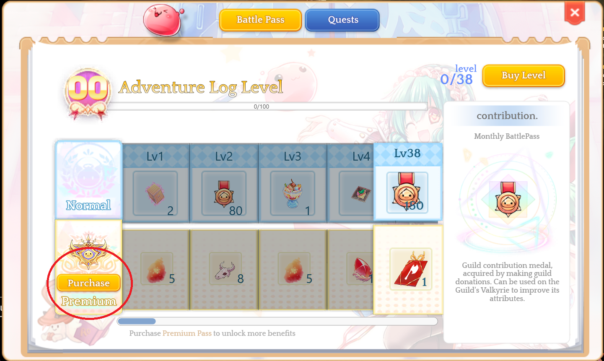
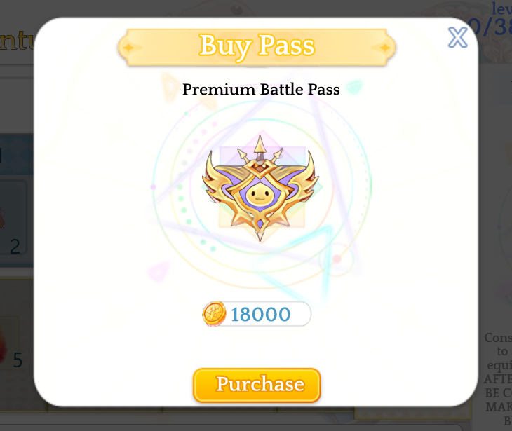
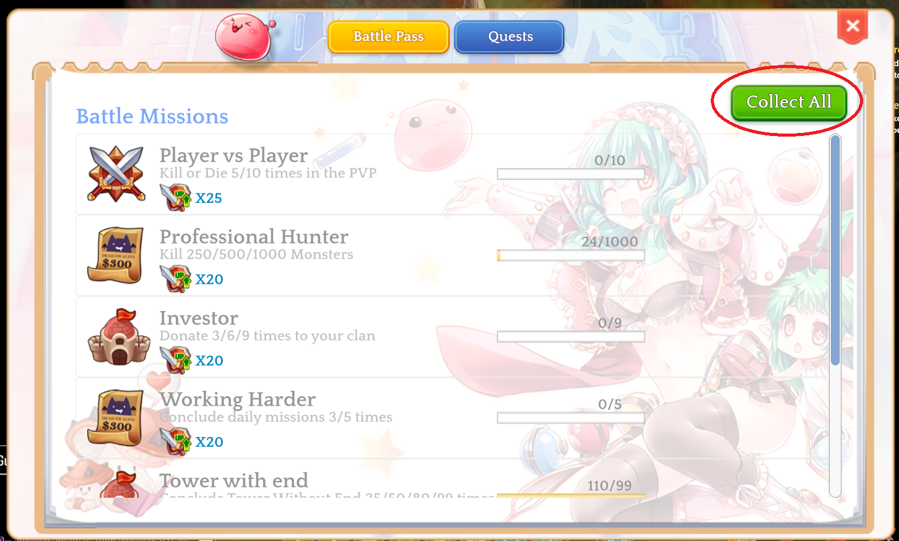

# 🎫 Battle Pass

<figure><figcaption></figcaption></figure>

## **Where to Purchase the Premium Pass?**

You can purchase it by accessing the **store** and buying a package labeled **Battle Pass 30 Days**, or acquire it within Arkaik by following these steps:

1. Press the **Battle Pass** button.

<figure><figcaption></figcaption></figure>

**2. Now click on Buy and confirm** _(18,000 CubePoints will be required in the account)._&#x20;

<mark style="color:red;">**Value may be changed (ASIA)**</mark>

<figure><figcaption></figcaption></figure>

<figure><figcaption></figcaption></figure>

## **How to collect Battle Pass EXP?**

* Collecting EXP is very simple. Follow the tips below to receive rewards.
* You must complete a mission in the MISSIONS tab.

<figure><figcaption></figcaption></figure>

1. After this, click the **COLLECT** button to receive your rewards.

<figure><figcaption></figcaption></figure>

## **How does the Mission System work?**

Each mission grants **experience**. After clicking **Collect**, all this **EXP** is converted into points in the general progression of the battle pass. As you gain battle levels, you receive rewards based on your account type (Basic/Premium).

Quests labeled as **"Daily"** reset every day at **00:00&#x20;**<mark style="color:red;">**(Asian time)**</mark>, allowing you to repeat them and earn more **experience**. For example, the **Professional Hunter** mission can be repeated, and you do not need to complete all other missions, such as **Player vs Player**, to progress your pass.

**Found an issue? Report it on our Discord.**
