# 🟩 (Bottom/Mouth) | June

<table><thead><tr><th width="255.6666259765625">Imagem</th><th>in-game</th><th>Valor</th></tr></thead><tbody><tr><td>
<figure><figcaption>
Aura Elétrica
</figcaption></figure>
</td><td>
<figure>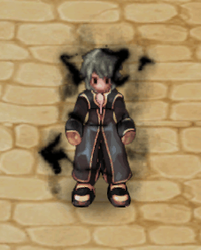<figcaption></figcaption></figure>
</td><td><strong>30.000 CP</strong></td></tr><tr><td>
<figure><figcaption>
Aura Elétrica
</figcaption></figure>
</td><td>
<figure>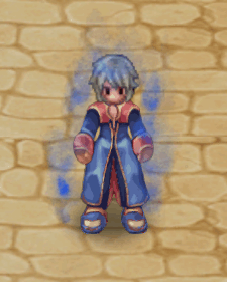<figcaption></figcaption></figure>
</td><td><strong>30.000 CP</strong></td></tr><tr><td>
<figure><figcaption>
Aura Elétrica
</figcaption></figure>
</td><td>
<figure>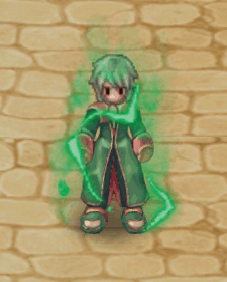<figcaption></figcaption></figure>
</td><td><strong>30.000 CP</strong></td></tr><tr><td>
<figure><figcaption>
Aura Elétrica
</figcaption></figure>
</td><td>
<figure>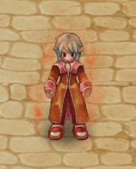<figcaption></figcaption></figure>
</td><td><strong>30.000 CP</strong></td></tr><tr><td>
<figure><figcaption>
Aura Elétrica
</figcaption></figure>
</td><td>
<figure>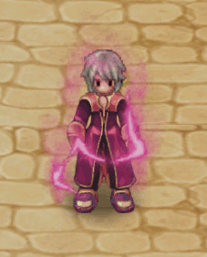<figcaption></figcaption></figure>
</td><td><strong>30.000 CP</strong></td></tr><tr><td>
<figure><figcaption>
Aura Elétrica
</figcaption></figure>
</td><td>
<figure>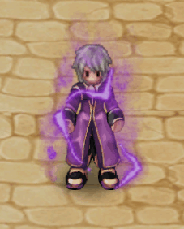<figcaption></figcaption></figure>
</td><td><strong>30.000 CP</strong></td></tr><tr><td>
<figure><figcaption>
Aura Elétrica
</figcaption></figure>
</td><td>
<figure>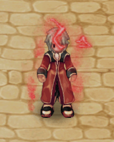<figcaption></figcaption></figure>
</td><td><strong>30.000 CP</strong></td></tr><tr><td>
<figure><figcaption>
Aura Elétrica
</figcaption></figure>
</td><td>
<figure>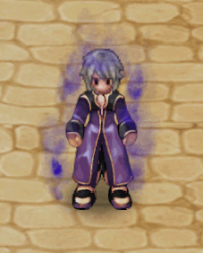<figcaption></figcaption></figure>
</td><td><strong>30.000 CP</strong></td></tr><tr><td>
<figure><figcaption>
Aura Elétrica
</figcaption></figure>
</td><td>
<figure>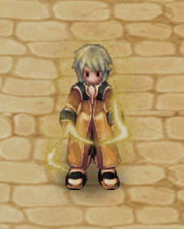<figcaption></figcaption></figure>
</td><td><strong>30.000 CP</strong></td></tr><tr><td>
<figure><figcaption>
Gato Paraquedista
</figcaption></figure>
</td><td>
<figure>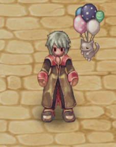<figcaption></figcaption></figure>
</td><td><strong>22.000 CP</strong></td></tr><tr><td>
<figure><figcaption>
Gato Paraquedista
</figcaption></figure>
</td><td>
<figure>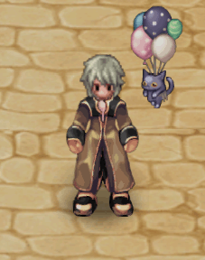<figcaption></figcaption></figure>
</td><td><strong>22.000 CP</strong></td></tr><tr><td>
<figure><figcaption>
Gato Paraquedista
</figcaption></figure>
</td><td>
<figure>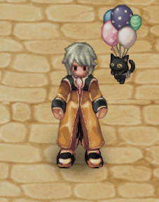<figcaption></figcaption></figure>
</td><td><strong>22.000 CP</strong></td></tr></tbody></table>
