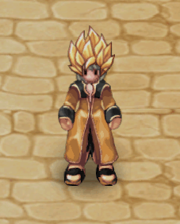
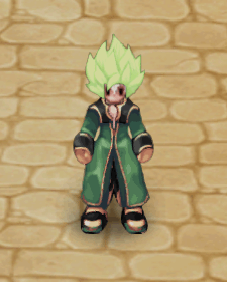
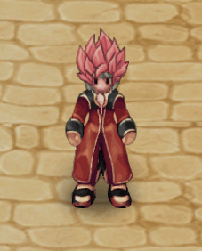
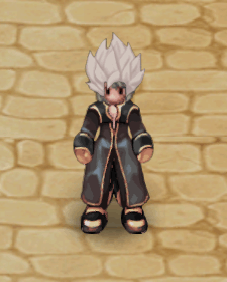
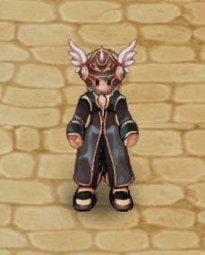
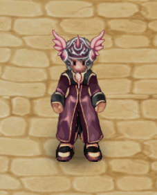
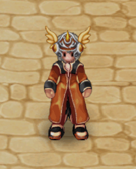
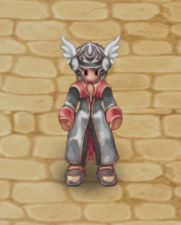

# 🟩 (Top/Head) | June

<table><thead><tr><th width="255.6666259765625">Imagem</th><th>in-game</th><th>Valor</th></tr></thead><tbody><tr><td>
<figure><figcaption>
Peruca de Super Saiyajin
</figcaption></figure>
</td><td>
<figure><figcaption></figcaption></figure>
</td><td><strong>26.000 CP</strong></td></tr><tr><td>
<figure><figcaption>
Peruca de Super Saiyajin Broly
</figcaption></figure>
</td><td>
<figure><figcaption></figcaption></figure>
</td><td><strong>26.000 CP</strong></td></tr><tr><td>
<figure><figcaption>
Peruca de Saiyajin Deus
</figcaption></figure>
</td><td>
<figure><figcaption></figcaption></figure>
</td><td><strong>26.000 CP</strong></td></tr><tr><td>
<figure><figcaption>
Peruca de Saiyajin Migatte
</figcaption></figure>
</td><td>
<figure><figcaption></figcaption></figure>
</td><td><strong>26.000 CP</strong></td></tr><tr><td>
<figure><figcaption>
Elmo de Guerreira Alada
</figcaption></figure>
</td><td>
<figure><figcaption></figcaption></figure>
</td><td><strong>18.000 CP</strong></td></tr><tr><td>
<figure><figcaption>
Elmo de Guerreira Alada
</figcaption></figure>
</td><td>
<figure><figcaption></figcaption></figure>
</td><td><strong>18.000 CP</strong></td></tr><tr><td>
<figure><figcaption>
Elmo de Guerreira Alada
</figcaption></figure>
</td><td>
<figure><figcaption></figcaption></figure>
</td><td><strong>18.000 CP</strong></td></tr><tr><td>
<figure><figcaption>
Elmo de Guerreira Alada
</figcaption></figure>
</td><td>
<figure><figcaption></figcaption></figure>
</td><td><strong>18.000 CP</strong></td></tr><tr><td>
<figure><figcaption>
Elmo de Guerreira Alada
</figcaption></figure>
</td><td>
<figure><figcaption></figcaption></figure>
</td><td><strong>18.000 CP</strong></td></tr></tbody></table>
