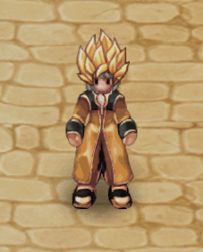
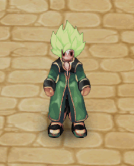
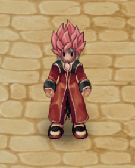
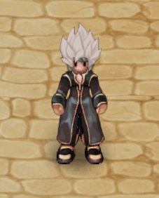
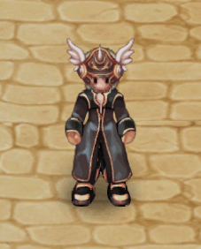
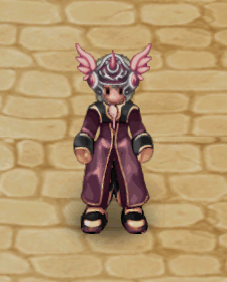
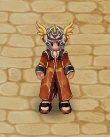
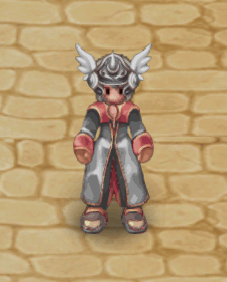

# 🟩 (Top/Head) | June

<table><thead><tr><th width="255.6666259765625">Image</th><th>in-game</th><th>Value</th></tr></thead><tbody><tr><td>
<figure><figcaption>
Super Saiyajin Wig
</figcaption></figure>
</td><td>
<figure><figcaption></figcaption></figure>
</td><td><strong>26.000 CP</strong></td></tr><tr><td>
<figure><figcaption>
Super Saiyajin Broly Hair
</figcaption></figure>
</td><td>
<figure><figcaption></figcaption></figure>
</td><td><strong>26.000 CP</strong></td></tr><tr><td>
<figure><figcaption>
Super Saiyajin God Wig
</figcaption></figure>
</td><td>
<figure><figcaption></figcaption></figure>
</td><td><strong>26.000 CP</strong></td></tr><tr><td>
<figure><figcaption>
Super Saiyajin Migatte Wig
</figcaption></figure>
</td><td>
<figure><figcaption></figcaption></figure>
</td><td><strong>26.000 CP</strong></td></tr><tr><td>
<figure><figcaption>
Helm of the Winged Warrior
</figcaption></figure>
</td><td>
<figure><figcaption></figcaption></figure>
</td><td><strong>18.000 CP</strong></td></tr><tr><td>
<figure><figcaption>
Helm of the Winged Warrior
</figcaption></figure>
</td><td>
<figure><figcaption></figcaption></figure>
</td><td><strong>18.000 CP</strong></td></tr><tr><td>
<figure><figcaption>
Helm of the Winged Warrior
</figcaption></figure>
</td><td>
<figure><figcaption></figcaption></figure>
</td><td><strong>18.000 CP</strong></td></tr><tr><td>
<figure><figcaption>
Helm of the Winged Warrior
</figcaption></figure>
</td><td>
<figure><figcaption></figcaption></figure>
</td><td><strong>18.000 CP</strong></td></tr><tr><td>
<figure><figcaption>
Helm of the Winged Warrior
</figcaption></figure>
</td><td>
<figure><figcaption></figcaption></figure>
</td><td><strong>18.000 CP</strong></td></tr></tbody></table>
