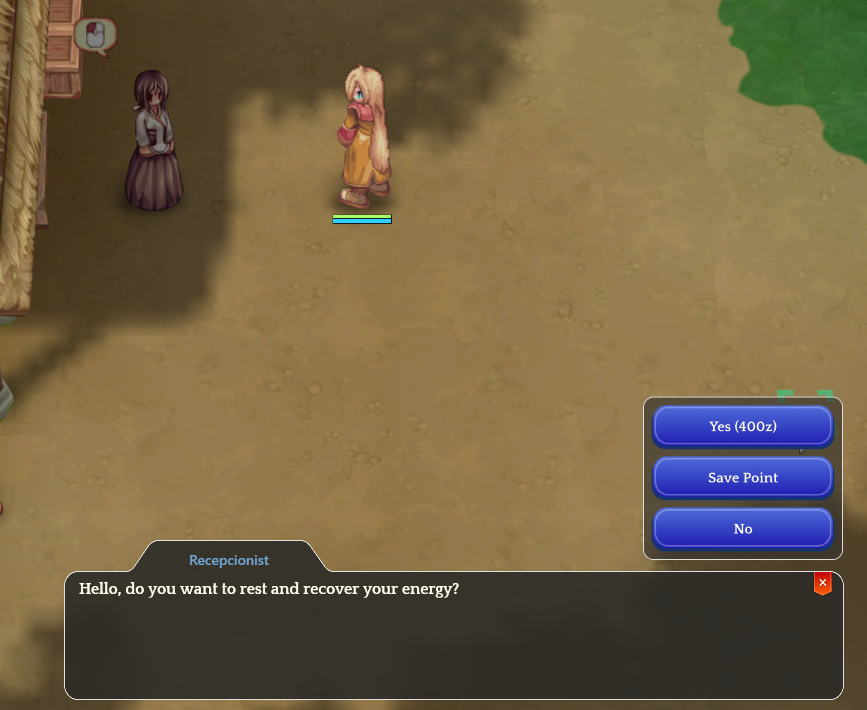

# Race to 99

<figure><figcaption></figcaption></figure>

**Exclusive Visuals of the race winners**

* **All 56 participants**

**How to check the rank**

* In the city of **"ZERO"**, find the NPC **"LEVEL RACE"**
* The NPC will show all the useful information for you to check the current ranking.
* “Check Recent”, “List by Class”, “Rewards”.

<figure><figcaption></figcaption></figure>

