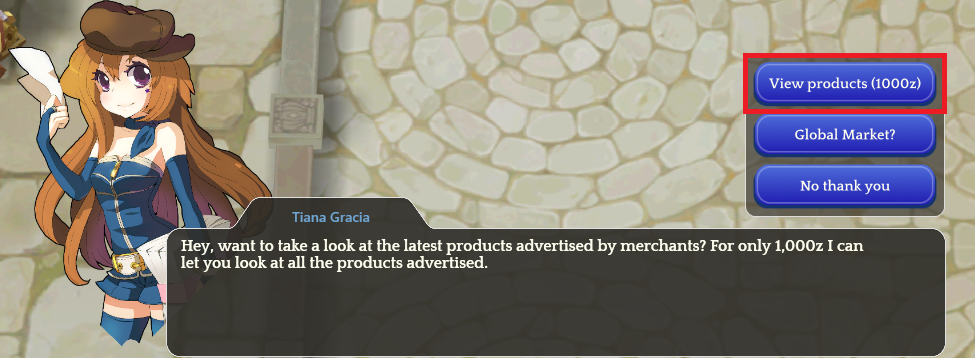
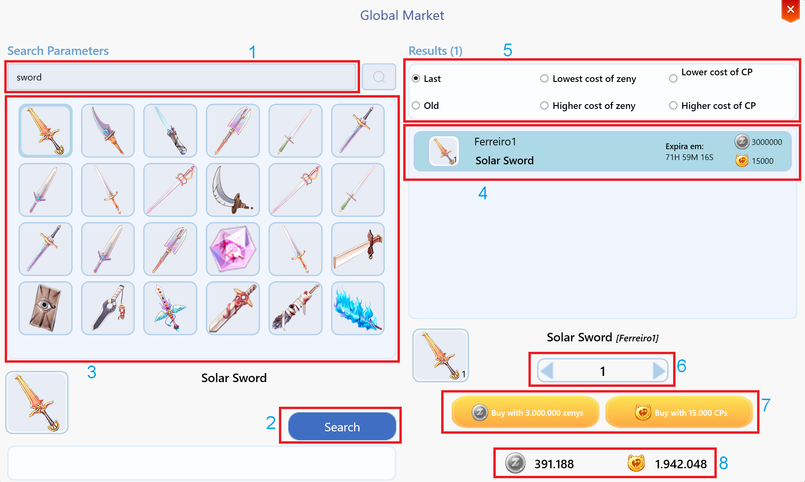
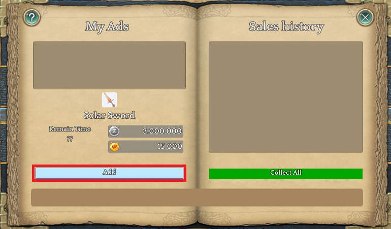
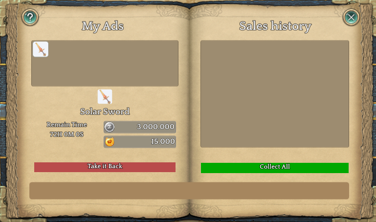

# 💹 Global Market

* The Global Market NPC is located in almost every city in the game, near the Kafra.
* They are responsible for listing all items on the server in a single place.
* To list an item on the market, you need to be a “[Merchant](jobs/class-guides/merchant.md)”.

<figure><figcaption>
<mark style="color:red;"><strong>Global Market NPC.</strong></mark>
</figcaption></figure>

## **How to use the Market**

* Every time you use the market you pay a fee of <mark style="color:red;">**1.000 Zeny**</mark>.

<figure><figcaption>
<mark style="color:red;"><strong>Cost to use the Global Market</strong></mark>
</figcaption></figure>

## Search Information

<figure><figcaption>
<mark style="color:red;"><strong>Global Market Information</strong></mark>
</figcaption></figure>

## **Global Market Glossary**

<table><thead><tr><th width="85" align="center">Number</th><th align="center">Information</th></tr></thead><tbody><tr><td align="center"><mark style="color:blue;"><strong>1</strong></mark></td><td align="center">Area intended for item search and lookup</td></tr><tr><td align="center"><mark style="color:blue;"><strong>2</strong></mark></td><td align="center">Search button</td></tr><tr><td align="center"><mark style="color:blue;"><strong>3</strong></mark></td><td align="center">Information and list of all items that contain a "<mark style="color:red;"><strong>Keyword</strong></mark>", "<mark style="color:red;"><strong>Sword</strong></mark>" lists all items that have the name Sword</td></tr><tr><td align="center"><mark style="color:blue;"><strong>4</strong></mark></td><td align="center">Items available in the market and their values</td></tr><tr><td align="center"><mark style="color:blue;"><strong>5</strong></mark></td><td align="center">Item filter in case the presented list is too large and you want to pick the cheapest</td></tr><tr><td align="center"><mark style="color:blue;"><strong>6</strong></mark></td><td align="center">Define the quantity of items to purchase</td></tr><tr><td align="center"><mark style="color:blue;"><strong>7</strong></mark></td><td align="center">Item cost, choose to buy using "<mark style="color:red;"><strong>Zenys</strong></mark>" or "<mark style="color:red;"><strong>Cube Points</strong></mark>"</td></tr><tr><td align="center"><mark style="color:blue;"><strong>8</strong></mark></td><td align="center">Your current Zeny and CubePoints</td></tr></tbody></table>

## **Advertising on the Global Market**

* Use the skill **"**<mark style="color:red;">**Advertise Product**</mark>**"**, from the **"**[**Merchant**](jobs/class-guides/merchant.md)**"**.
* Add the item in the window and set its value in **"**<mark style="color:red;">**Zeny**</mark>**"**, and **"**<mark style="color:red;">**Cube Points**</mark>**"**.
* Then click <mark style="color:green;">**Add**</mark>.
* To check if any item has been sold, it will appear in your **"**<mark style="color:red;">**Sales History**</mark>**"**.

<figure><figcaption>
<mark style="color:red;"><strong>Adding item.</strong></mark>
</figcaption></figure>

<figure><figcaption>
<mark style="color:red;"><strong>Item advertised.</strong></mark>
</figcaption></figure>
