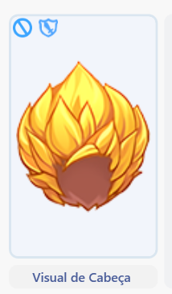

# 💹 Global Market

* The Global Market NPC is located in almost every city in the game, near the Kafra.
* They are responsible for listing all items on the server in a single place.
* To list an item on the market, you need to be a “[Merchant](jobs/class-guides/merchant.md)”.

<figure><figcaption>
Global Market NPC.
</figcaption></figure>

